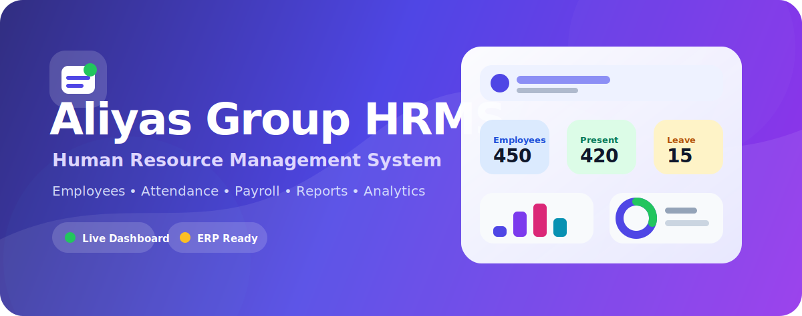

# HRMS - Human Resource Management System
## Aliyas Group ERP

<div align="center">

</div>

## Overview

This repository contains a frontend prototype for an enterprise **Human Resource Management System**. It includes modules for employee management, attendance, payroll, loans, assets, visa processing, exit management, automation, analytics, users, audit logs, and settings.

## Main Modules

- Dashboard overview
- Employee directory, employee creation, profile, and import screens
- Attendance dashboard, upload, reports, corrections, employee attendance, and settings
- Payroll dashboard, salary run, payslip, commission, bonus, approvals, history, and deductions
- Loan dashboard, requests, approvals, settlement, and deduction previews
- Asset inventory, creation, assignment, return, damage/loss, maintenance, and history
- Visa dashboard, list, new process, renewal, cancellation, absconding, alerts, documents, and timeline
- Exit process, final settlement, asset/loan/visa clearance, approvals, certificates, and history
- Automation rules, workflows, logs, notifications, approvals, simulation, and settings
- Analytics and reports center
- Company, users, audit logs, and general settings

## Tech Stack

- React 19
- TypeScript
- Vite
- Tailwind CSS v4
- React Router
- Recharts
- Lucide React

## Run Locally

Install dependencies:

```bash
npm install
```

Start development server:

```bash
npm run dev
```

Open:

```text
http://localhost:3000/
```

Run TypeScript check:

```bash
npm run lint
```

Create production build:

```bash
npm run build
```

Preview production build:

```bash
npm run preview
```

## Vercel Deployment

This project includes `vercel.json` with SPA rewrites, so direct URLs like `/employees`, `/attendance`, and `/payroll` should work after deployment.

Recommended Vercel settings:

```text
Framework Preset: Vite
Build Command: npm run build
Output Directory: dist
Install Command: npm install
```

## Notes

The current app is a frontend prototype with static/mock data. Backend APIs, authentication, database integration, and production business logic can be added in the next phase.
